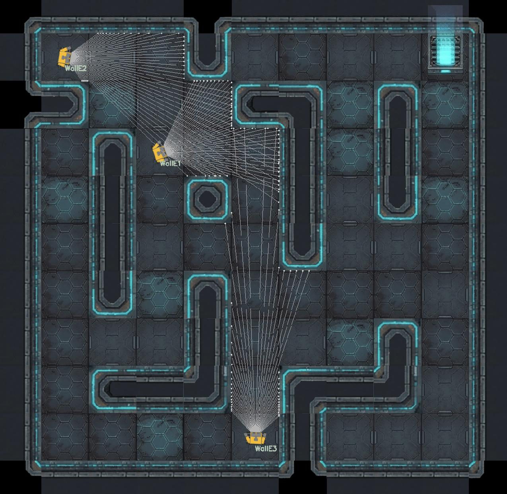

Robomaze: an interactive maze to learn ROS and help Wall-E
==========================================================

Pre-requisites
--------------

- a working ROS1 installation (tested with ROS melodic, but should work with
  other ones as well)

Usage
-----

- start the main script: `./robomaze_ros.py`
- create new robots by publish on `/create_robot`
- robots' odometry, TF frames, laserscan are then published, and the robots can
  be controlled by publishing to their `/cmd_vel` topics.

