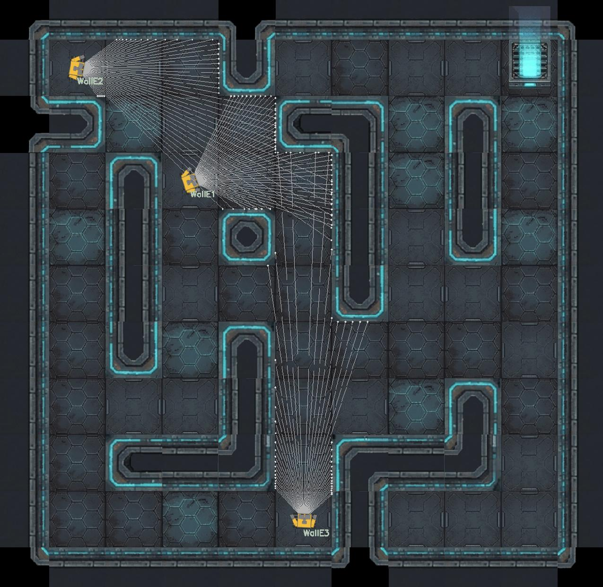

# Robomaze (ROS2)

Changes of this branch:
* Port of robomaze into port 2.
* Add method of random generator

An interactive 2D maze simulator for ROS2. Spawn robots, control them, and
access their odometry, laser scans, and TF frames!



## Prerequisites

- ROS2 (tested with Jazzy)
- Python 3
- Python deps (`pip install -r requirements.txt`)
  - Or system OpenCV: `sudo apt install python3-opencv`

## Build

```bash
# From your colcon workspace src/ directory:
cd ~/ros2_ws/src
ln -s /path/to/robomaze_ros2 robomaze

# Build
cd ~/ros2_ws
colcon build --packages-select robomaze
source install/setup.bash
```

## Usage

### Start the simulator

```bash
ros2 launch robomaze simulator_launch.py
```

An OpenCV window will open showing the maze.

### Spawn a robot

```bash
ros2 topic pub --once /create_robot std_msgs/msg/String "data: 'WallE1'"
```

### Control with keyboard

In a second terminal:

```bash
ros2 run robomaze keyboard_teleop --ros-args -p robot_name:=WallE1
```

- Arrow up/down: increase/decrease linear speed
- Arrow left/right: increase/decrease angular speed
- `q`: quit

## Topic Interface

| Topic | Type | Direction | Description |
|-------|------|-----------|-------------|
| `/create_robot` | `std_msgs/String` | You publish | Send robot name to spawn |
| `/<name>/scan` | `sensor_msgs/LaserScan` | Simulator publishes | Lidar: -45 to +45 deg, 2 deg steps |
| `/<name>/odom` | `nav_msgs/Odometry` | Simulator publishes | Robot pose and velocity |
| `/<name>/cmd_vel` | `geometry_msgs/Twist` | You publish | `linear.x` and `angular.z` |

### TF Frames

The simulator broadcasts: `<name>_odom` -> `<name>_base_link`

## Visualize in RViz2

```bash
rviz2
```

- Add a `LaserScan` display, topic: `/WallE/scan`
- Add a `TF` display to see the robot frame
- Set fixed frame to `WallE_odom`
