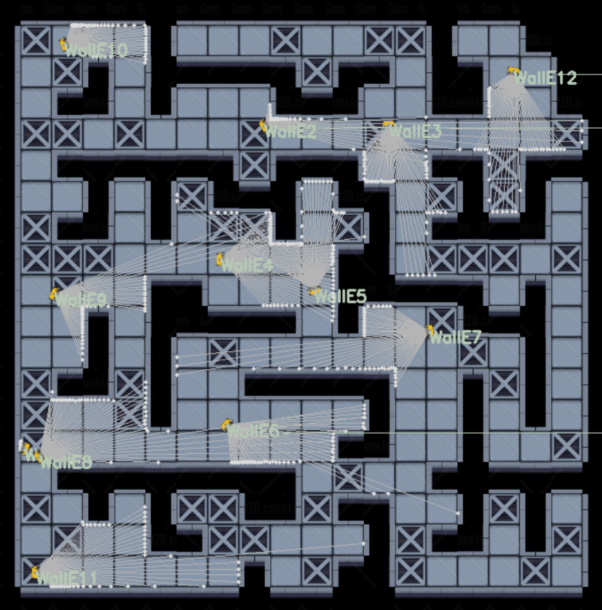

Robomaze: an interactive maze to learn ROS and help Wall-E
==========================================================

Spawn robots in the maze, control each of them, and access their odometry, laser scans and tf frames!



Pre-requisites
--------------

- a working ROS1 installation (tested with ROS melodic, but should work with
  other ones as well)

Usage
-----

- start the main script: `./robomaze_ros.py`
- create new robots by publish on `/create_robot`
- robots' odometry, TF frames, laserscan are then published, and the robots can
  be controlled by publishing to their `/cmd_vel` topics.


Mapping
-------

```
rosrun hector_mapping hector_mapping scan:=/WallE/scan _base_frame:=WallE_base_link _odom_frame:=WallE_odom _map_resolution:=0.5
```

Related projects
----------------

Not entierly unlike [stage](http://wiki.ros.org/stage) (but well, I'm not pretending to build a real robot simulator!)


